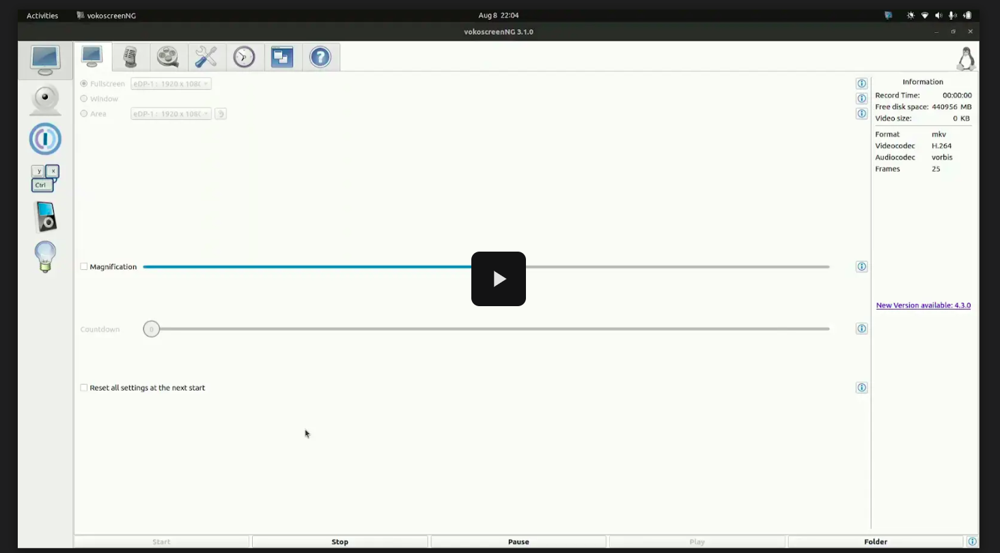

[](https://drive.google.com/file/d/1ke0XbPN9iWjfp6sSuiCP1XfcCbZm8_nX/view?usp=sharing) | [](https://drive.google.com/file/d/1DZikycVrDv5St1zge4WKLWvAyWtqwO-R/view?usp=sharing) | [](https://drive.google.com/file/d/1jGSJrqjMciINH5OiUwlpMRe6pR6Z1EJd/view?usp=sharing)|[](https://drive.google.com/file/d/1gBN-PhuQQ6OgJll4vY_ddOACH-6zBuhP/view?usp=sharing
)


#  ROS2-Based Mobile Robot Navigation & Mapping System (Humble + PyBullet)

This repository contains a modular robotics framework using **ROS 2 Humble**, with simulation in **PyBullet**, and visualizations via **RViz2**. It supports:

- ML-enhanced A* global path planning
- Monte Carlo Localization (MCL)
- EKF SLAM with feature-based landmark tracking
- Real-time visualization of paths, particles, landmarks
- Fully based on `colcon build` (no Catkin)

---


## Project Directory Structure
```
ROS_ASSIGNMENT-NK_CODE/
├── install/                      
├── src/
│   ├── navigation_pkgs/
│   │   ├── astar_ml_pkg/            # ML-powered A* path planner
│   │   ├── astar_pkg/               # Classical A* path planner
│   │   ├── EKF_SLAM_pkg/            # Extended Kalman Filter SLAM
│   │   └── mcl_pkg/                 # Monte Carlo Localization (MCL)
│   │
│   └── simulation_pkgs/
│       └── pybullet_sim_pkg/       # PyBullet simulation environment
│           ├── pybullet_sim_pkg/   # Python module folder (ROS 2 Python pkg format)
│           ├── resource/
│           ├── test/
│           ├── package.xml
│           ├── setup.cfg
│           └── setup.py
│
├── .gitignore               
├── readme.md               
```

---

## 📦 Package Overview

This repository is organized into several ROS 2 packages, each with a specific role. For detailed information, follow the link to the package's dedicated `README.md`.

| Package                                       | Description                                                                                                                              | README Link                  |
| :-------------------------------------------- | :--------------------------------------------------------------------------------------------------------------------------------------- | :--------------------------- |
| **`pybullet_sim_pkg`** | Provides a flexible PyBullet-based simulation environment, publishing odometry, laser scans, and a static map.                           | [README](./src/simulation_pkgs/pybullet_sim_pkg/simulation.md)   |
| **`EKF_SLAM_pkg`**      | Implements **EKF-based SLAM**, concurrently building a map of landmarks and estimating the robot's pose. Fully visualized in RViz2.          | [README](./src/navigation_pkgs/EKF_SLAM_pkg/ekf_slam.md)       |
| **`mcl_pkg`**           | A highly optimized **Monte Carlo Localization (MCL)** node (particle filter) for robust robot pose estimation within a known map.            | [README](src/navigation_pkgs/mcl_pkg/mcl.md)            |
| **`astar_pkg`**         | A robust implementation of the classic **A\* path planning algorithm** with a Pure Pursuit controller for path following.                    | [README](src/navigation_pkgs/astar_pkg/astar.md)          |
| **`astar_ml_pkg`**      | An advanced package featuring a **Hybrid A\* planner** that uses a Machine Learning (GradientBoostingRegressor) model to create a superior heuristic, leading to faster and more efficient pathfinding. | [README](src/navigation_pkgs/astar_ml_pkg/astar_ml.md)       |


## Setup Instructions

### 1. Create ROS 2 Workspace (Colcon)

```bash
mkdir -p ~/ros2_ws/src
cd ~/ros2_ws
```

### 2. Clone the Repository

cd ~/ros2_ws/src
git clone https://github.com/mkumar7404508129/ROS_ASSIGNMENT.git

### 3. Install Dependencies
sudo apt update
rosdep update
cd ~/ros2_ws
rosdep install --from-paths src --ignore-src -r -y

### 4. Build Workspace
cd ~/ros2_ws
colcon build

### 5. Source the Workspace
source ~/ros2_ws/install/setup.bash

---

###  Run Commands for Each Component (ROS 2 + colcon)

> Use in a **new terminal tab** for each component. Don’t forget to `source` the workspace every time.

> These assume your workspace root is `~/ros2_ws` and all packages are in `src/navigation_pkgs/` or `src/simulation_pkgs/`.

---

### 1. Train ML Model for A\*

```bash
cd ~/ros2_ws
colcon build --packages-select astar_ml_pkg
source install/setup.bash
ros2 run astar_ml_pkg train_model
```

---

### 2. ML-Powered A\* Path Planner

```bash
cd ~/ros2_ws
colcon build --packages-select astar_ml_pkg
source install/setup.bash
ros2 run astar_ml_pkg astar_ml_node
```

---

### 3. Classic A\* Planner

```bash
cd ~/ros2_ws
colcon build --packages-select astar_pkg
source install/setup.bash
ros2 run astar_pkg astar
```

---

### 4. Monte Carlo Localization (MCL)

```bash
cd ~/ros2_ws
colcon build --packages-select mcl_pkg
source install/setup.bash
ros2 run mcl_pkg mcl_node
```
| **`astar_pkg`** | A robust implementation of the classic **A\* path planning algorithm** with a Pure Pursuit controller for path following.                    |
| **`astar_ml_pkg`** | An advanced package featuring a **Hybrid A\* planner** that uses a Machine Learning (GradientBoostingRegressor) model to create a superior heuristic, leading to faster and more efficient pathfinding. |

---
> To publish the map (if needed):

```bash
ros2 run mcl_pkg map_publisher
```

---

### 5. EKF SLAM

```bash
cd ~/ros2_ws
colcon build --packages-select EKF_SLAM_pkg
source install/setup.bash
ros2 run EKF_SLAM_pkg ekf_slam
```

---

### 6. PyBullet Simulation – Robot Simulator

```bash
cd ~/ros2_ws
colcon build --packages-select pybullet_sim_pkg
source install/setup.bash
ros2 run pybullet_sim_pkg robot_simulator_node
```

> For rectangular motion test:

```bash
ros2 run pybullet_sim_pkg rectangular_motion_node
```


