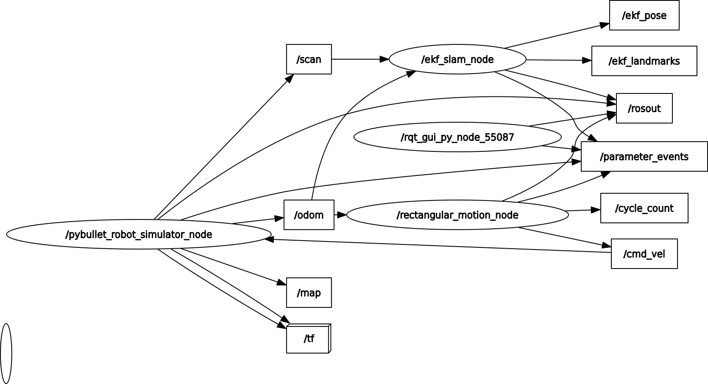
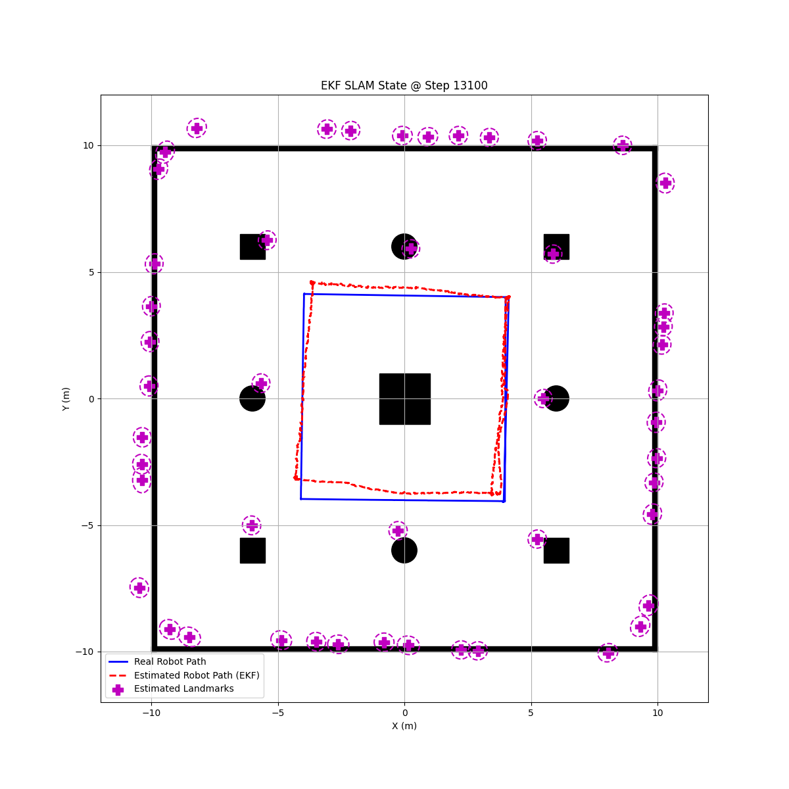

# EKF SLAM using PyBullet Simulation and RViz2 Visualization

This ROS 2 package provides a complete implementation of an Extended Kalman Filter (EKF) based Simultaneous Localization and Mapping (SLAM) algorithm. The node is designed to process odometry and laser scan data from a **PyBullet simulation** to concurrently estimate the robot's pose and the positions of unknown landmarks in the environment.

A key feature of this package is its real-time visualization capability. The node publishes the robot's estimated pose and the landmark map directly to topics that can be visualized in **RViz2**, providing immediate insight into the algorithm's performance.

---

## System Architecture

The `ekf_slam_node` acts as the core processing unit. It subscribes to a simulation environment that provides odometry and sensor data, and in turn, publishes the estimated state for visualization and further use.

The ROS computation graph below illustrates the interaction between the nodes and topics:



---

## EKF SLAM Node (`ekf_slam`)

This is the single, all-in-one node that performs the entire SLAM process.

### Core Functionality

* **Prediction Step**: The node uses velocity information derived from `/odom` messages to predict the robot's state forward in time. This step increases the uncertainty in the state estimate.
* **Feature Detection**: It processes raw `/scan` data to detect features. It does this by clustering consecutive laser points, assuming that small, tight clusters represent landmarks (like the cylinders and boxes in the simulation).
* **Data Association**: For each detected feature, the node decides if it corresponds to a previously seen landmark or if it is a new, unobserved landmark. This is a critical step in SLAM, solved here using a nearest-neighbor approach with a distance threshold.
* **Update Step**: When a known landmark is re-observed, the algorithm uses the measurement to correct the predicted state of both the robot and the observed landmark. This step reduces the uncertainty in the state estimate.
* **Visualization**: The node is heavily instrumented for visualization. It publishes the robot's pose with its covariance ellipse and the map of landmarks to dedicated topics for RViz2. It also periodically saves a plot of the current SLAM state to a file.

### **Inputs (Subscribed Topics)**

| Topic   | Message Type              | Description                                                                                               |
| :------ | :------------------------ | :-------------------------------------------------------------------------------------------------------- |
| `/odom` | `nav_msgs/msg/Odometry`   | Provides motion data (position and orientation) used for the EKF prediction step.                         |
| `/scan` | `sensor_msgs/msg/LaserScan` | Provides raw sensor data from which landmarks are detected, forming the measurements for the EKF update step. |

### **Outputs**

| Type  | Name                    | Description                                                                                                                                                                                                       |
| :---- | :---------------------- | :---------------------------------------------------------------------------------------------------------------------------------------------------------------------------------------------------------------- |
| **Topic** | `/ekf_pose`             | Publishes the robot's estimated pose and covariance (`geometry_msgs/msg/PoseWithCovarianceStamped`). This can be visualized in RViz2 as an arrow with an uncertainty ellipse.                                     |
| **Topic** | `/ekf_landmarks`        | Publishes the estimated positions of all landmarks in the map (`visualization_msgs/msg/MarkerArray`). These appear as sphere markers in RViz2.                                                                     |
| **File** | `slam_latest_state.png` | An image file that is periodically updated to show the ground truth path, the EKF estimated path, and the landmark map with uncertainty ellipses. This provides a comprehensive overview of the SLAM performance. |

#### Example Output (`slam_latest_state.png`)



---

## How to Build, Run, and Visualize

Follow these steps to launch the EKF SLAM system.

### Step 1: Run the Simulation

First, ensure you have a simulation environment running that provides both a `/map` and an `/odom` topic. You will also need a robot controller to drive the robot around to explore the environment.

```bash
# In Terminal 1: Launch the simulation
ros2 run pybullet_sim_pkg robot_simulator_node

# In Terminal 2: Launch a controller to move the robot
ros2 run pybullet_sim_pkg rectangular_motion_node
```
### Step 2: Build and Run the EKF SLAM Node
In a new terminal, build the EKF_SLAM_pkg and run the node.
```
# In Terminal 3

# Navigate to your ROS 2 workspace and build the package
colcon build --packages-select EKF_SLAM_pkg

# Source the workspace
source install/setup.bash

# Run the EKF SLAM node
ros2 run EKF_SLAM_pkg ekf_slam
```
### Step 3: Visualize in RViz2
This is the most insightful part. Open RViz2 to see the SLAM process in real-time.
```
# In Terminal 4
rviz2
```

