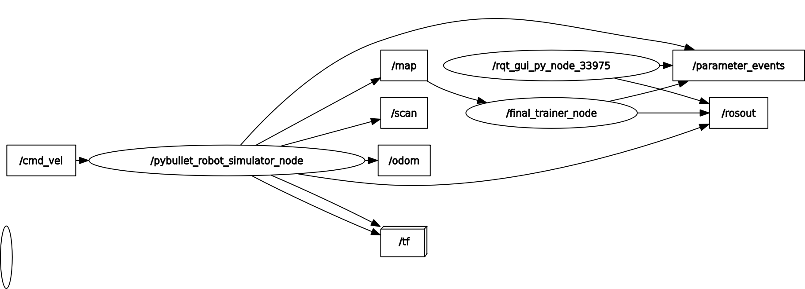
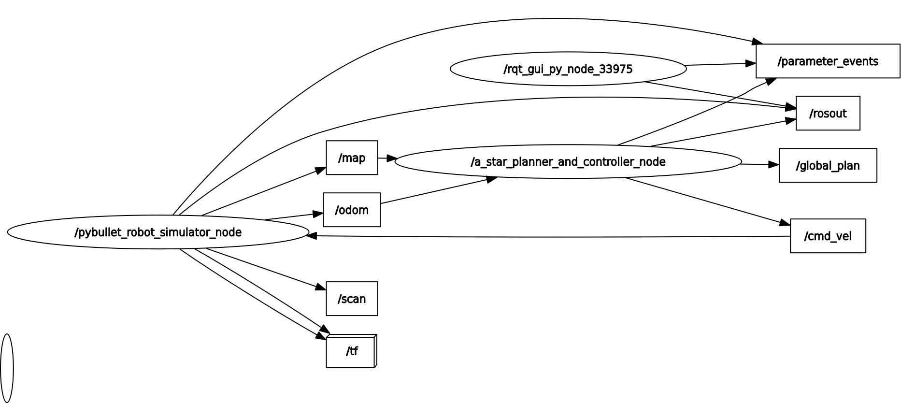
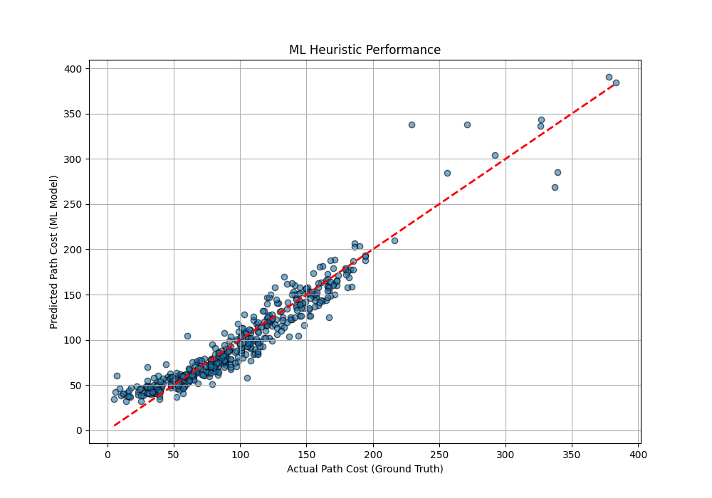
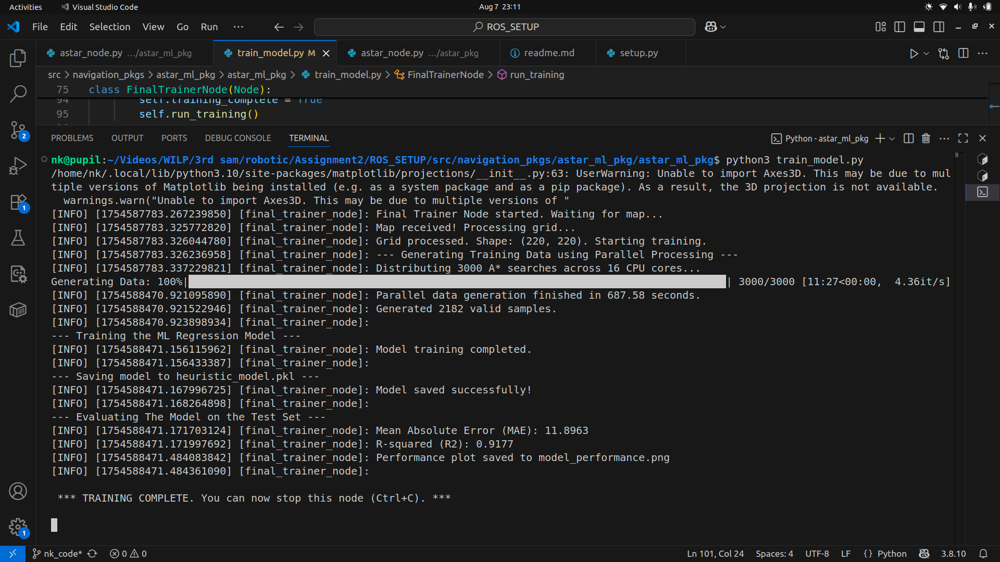
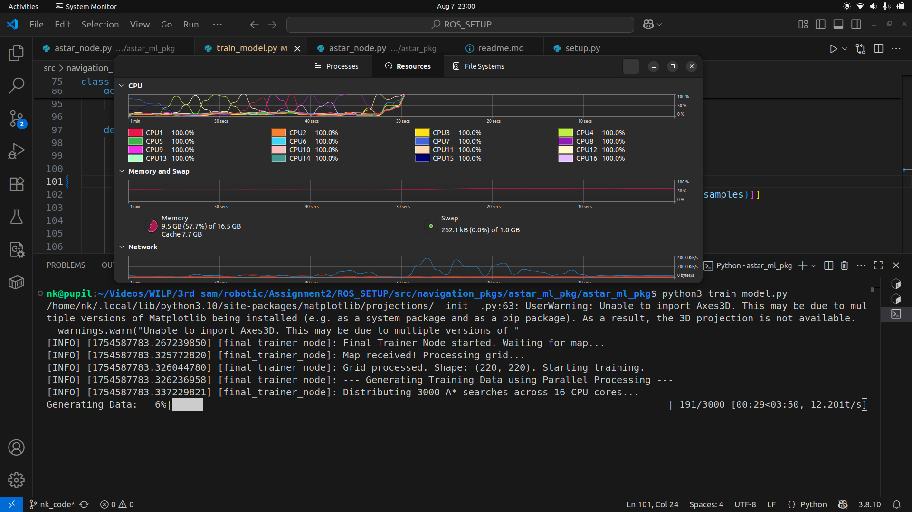
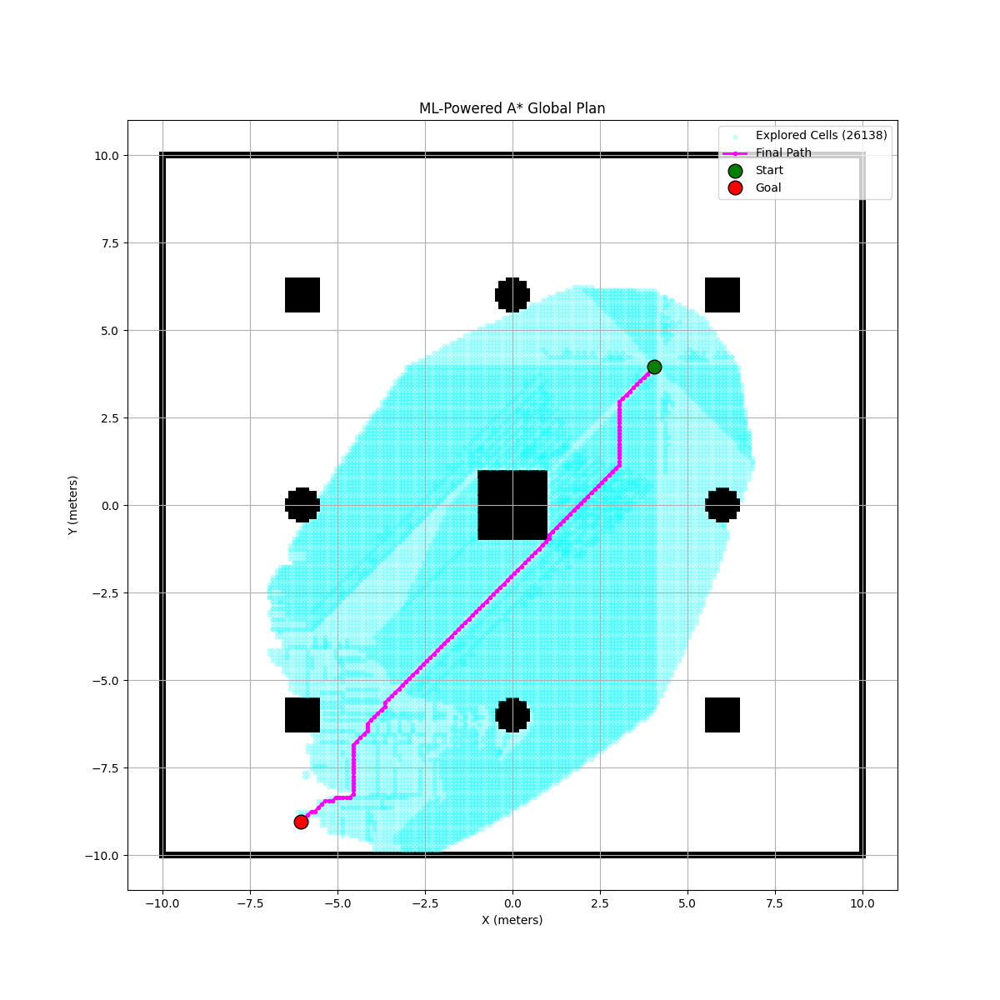

# ML-Powered A* Path Planning in ROS 2

This ROS 2 package demonstrates an advanced path planning approach where a machine learning model is trained to predict path costs, serving as a powerful heuristic for an A* search algorithm.

The project is divided into two primary nodes:
1.  `train_model`: A node responsible for generating training data from a map and training a regression model.
2.  `astar_ml_node`: A planner and controller that uses the trained model to find and follow an efficient path in real-time.

---

## 🤖 System Architecture

The workflow is a two-stage process:

1.  **Offline Training Stage**: The `train_model` node listens for a map, generates a large dataset by running thousands of traditional A* searches in parallel, and trains a `GradientBoostingRegressor` model. The output is a `heuristic_model.pkl` file.


2.  **Online Planning Stage**: The `astar_ml_node` loads the pre-trained `.pkl` model. It uses this model to power a **Hybrid A* Search**, where the heuristic is the maximum of the classic Euclidean distance and the ML model's prediction. This ensures the heuristic is both fast and admissible. The node then plans a path and controls the robot to follow it.


---

## 1. Model Trainer Node (`train_model`)

This node's sole purpose is to create the ML heuristic model. It is designed to be run once (or whenever the environment changes) to produce the `heuristic_model.pkl` artifact.

### Core Functionality

* **Data Generation**: Subscribes to the `/map` topic. Once the map is received, it identifies all non-obstacle cells and generates thousands of random start/goal pairs.
* **Parallel Processing**: To speed up data generation, it uses Python's `multiprocessing.Pool` to distribute the A* search tasks across all available CPU cores, providing a significant performance boost. A `tqdm` progress bar shows the status.
* **Model Training**: It trains a `sklearn.ensemble.GradientBoostingRegressor` model on the generated data (`X`: start/goal coordinates, `y`: true path cost).
* **Evaluation & Output**: After training, it evaluates the model's performance on a test set, prints the Mean Absolute Error (MAE) and R-squared (R2) score, and saves the results to a plot.

### **Inputs (Subscribed Topics)**

| Topic | Message Type | Description |
| :--- | :--- | :--- |
| `/map` | `nav_msgs/msg/OccupancyGrid` | The static map of the environment used to generate training data. |

### **Outputs (Generated Files)**

| File | Description |
| :--- | :--- |
| `heuristic_model.pkl` | The serialized, trained machine learning model. This is the primary artifact used by the planner node. |
| `model_performance.png` | A scatter plot comparing the model's predicted path costs against the actual costs (ground truth). |

#### Example Output (`model_performance.png`)





---

## 2. A* Planner & Controller Node (`astar_ml_node`)

This is the main operational node. It performs the path planning and execution using the model created by the trainer.

### Core Functionality

* **Model Loading**: On startup, it immediately loads the `heuristic_model.pkl` file. If the file is not found, the node will exit with an error.
* **Hybrid A* Search**: The core of the planner is its heuristic function. For any given cell, it calculates both the standard Euclidean distance and the ML model's prediction for the cost-to-go. It uses the **maximum** of these two values as the final heuristic. This hybrid approach ensures the heuristic remains admissible (it never overestimates the cost, preventing suboptimal paths) while benefiting from the learned, more accurate predictions of the ML model.
* **Path Control**: Once a path is found, a Pure Pursuit-style controller is activated. It calculates the required linear and angular velocities to follow the path smoothly.
* **Visualization**: The node publishes the final path to the `/global_plan` topic for visualization in RViz and also saves a plot of the plan overlaid on the map.

### **Inputs**

| Type | Name | Description |
| :--- | :--- | :--- |
| **File** | `heuristic_model.pkl` | The trained ML model. |
| **Topic** | `/map` | The static map of the environment. |
| **Topic** | `/odom` | The robot's current position and orientation, used for path following and to determine the starting point. |

### **Outputs**

| Type | Name | Description |
| :--- | :--- | :--- |
| **Topic** | `/cmd_vel` | `geometry_msgs/msg/Twist` messages to drive the robot. |
| **Topic** | `/global_plan` | `nav_msgs/msg/Path` message containing the full planned path for visualization. |
| **File** | `ml_path_plan.png` | A plot showing the map, the cells explored by A*, and the final path from start to goal. |

#### Example Output (`ml_path_plan.png`)


---

## 🚀 How to Build and Run

Follow this three-step process to run the full system.

### Step 1: Run the Simulation

First, you need an environment that publishes a map. Start your simulation node (e.g., the `pybullet_sim_pkg` from the previous project).

```bash
# In Terminal 1
ros2 run pybullet_sim_pkg robot_simulator_node
```
### Step 2: Train the Heuristic Model
Next, run the train_model node. This node will wait for the map, generate data, train the model, and then shut down automatically upon completion. You only need to do this once.
```
# In Terminal 2
# First, build the package
colcon build --packages-select astar_ml_pkg

# Then, source the workspace
source install/setup.bash

# Finally, run the training node
ros2 run astar_ml_pkg train_model
```
Wait for the console to print *** TRAINING COMPLETE ***. You will now have heuristic_model.pkl in your directory.

### Step 3: Run the ML-Powered Planner
Once the model is trained, you can run the planner and controller node. It will load the model and begin planning a path for the robot as soon as it gets its first odometry message.
```
# In Terminal 2 (after the training node finishes)
ros2 run astar_ml_pkg astar_ml_node
```