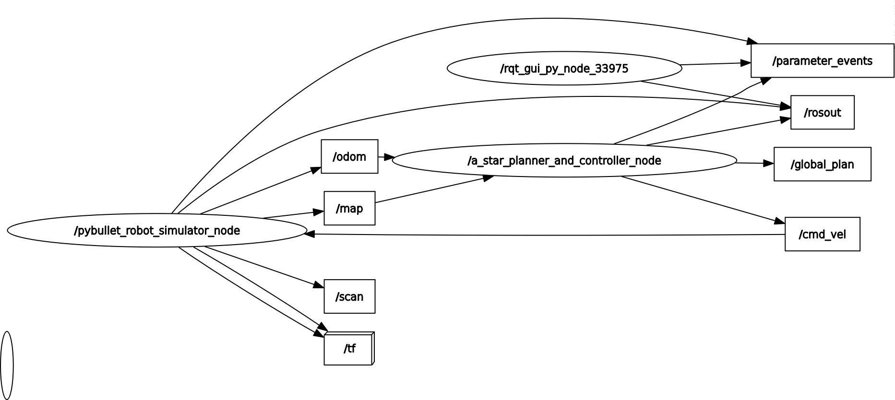
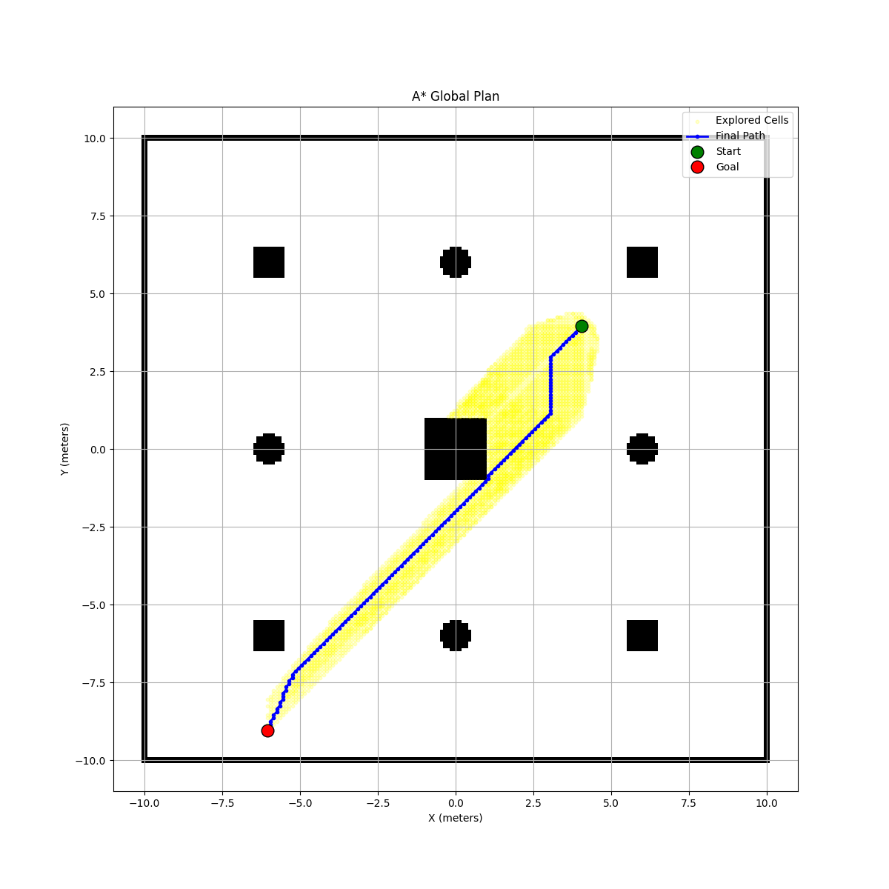

# A* Global Planner and Controller for ROS 2

This ROS 2 package provides a complete, self-contained A* path planning and control solution. The `astar_node` is designed to navigate a robot from a dynamically determined start point to a fixed goal within a given map.

The node performs two main functions:
1.  **Global Path Planning**: It uses the classic A* search algorithm to find the shortest path on a 2D occupancy grid.
2.  **Path Following Control**: It implements a Pure Pursuit-style controller to generate velocity commands that steer the robot along the calculated path.

---

## System Architecture

The `astar_node` integrates with a simulation environment to perform its tasks. It subscribes to map and odometry data and publishes velocity commands and the final path for visualization.

The relationship between the nodes and topics is shown in the ROS computation graph below:



---

## A* Planner & Controller Node (`astar`)

This single, powerful node handles all aspects of planning and execution. It is designed to be robust and efficient, waiting for all necessary information before starting its process.

### Core Functionality

* **Dynamic Start Point**: The node does not require a pre-set start position. Instead, it waits for the first odometry message from the `/odom` topic and uses that as the robot's initial location.
* **A* Search**: It implements the standard A* algorithm with a Euclidean distance heuristic to find an optimal path from the start to the goal, avoiding obstacles defined in the `/map`.
* **Pure Pursuit Controller**: After a path is found, a control loop is initiated. This controller looks ahead on the path, calculates the necessary heading to intercept the lookahead point, and generates smooth `Twist` messages to drive the robot. The robot's linear speed is scaled down during sharp turns for better stability.
* **Visualization**: The node is instrumented to provide rich feedback. It publishes the final path to `/global_plan` for viewing in RViz and also generates a `path_plan.png` image that overlays the explored cells and the final path on the map.

### **Inputs (Subscribed Topics)**

| Topic  | Message Type                | Description                                                                                             |
| :----- | :-------------------------- | :------------------------------------------------------------------------------------------------------ |
| `/map` | `nav_msgs/msg/OccupancyGrid` | Receives the static 2D map of the environment. The node waits for this before planning.                 |
| `/odom`| `nav_msgs/msg/Odometry`      | Provides the robot's current position and orientation. Used for path following and to set the start point. |

### **Outputs**

| Type | Name | Description |
| :--- | :--- | :--- |
| **Topic** | `/cmd_vel` | Publishes `geometry_msgs/msg/Twist` messages to control the robot's velocity. |
| **Topic** | `/global_plan` | Publishes a `nav_msgs/msg/Path` message for visualizing the planned route in tools like RViz. |
| **File** | `path_plan.png` | An image file showing the final path, the start/goal points, and the cells explored by the A* algorithm. |

#### Example Output (`path_plan.png`)


---

## How to Build and Run

Follow these steps to launch the A* planner.

### Step 1: Run the Simulation

First, ensure you have a simulation environment running that provides both a `/map` and an `/odom` topic.

```bash
# In Terminal 1
# Example using a pre-existing simulation package
ros2 run pybullet_sim_pkg robot_simulator_node
```
### Step 2: Build and Run the A* Node
In a new terminal, build the astar_pkg and run the node. The node will automatically start planning as soon as it receives the map and the robot's initial pose.

```
# In Terminal 2

# Navigate to your ROS 2 workspace and build the package
colcon build --packages-select astar_pkg

# Source the workspace to make the executable available
source install/setup.bash

# Run the A* planner and controller node
ros2 run astar_pkg astar
```

