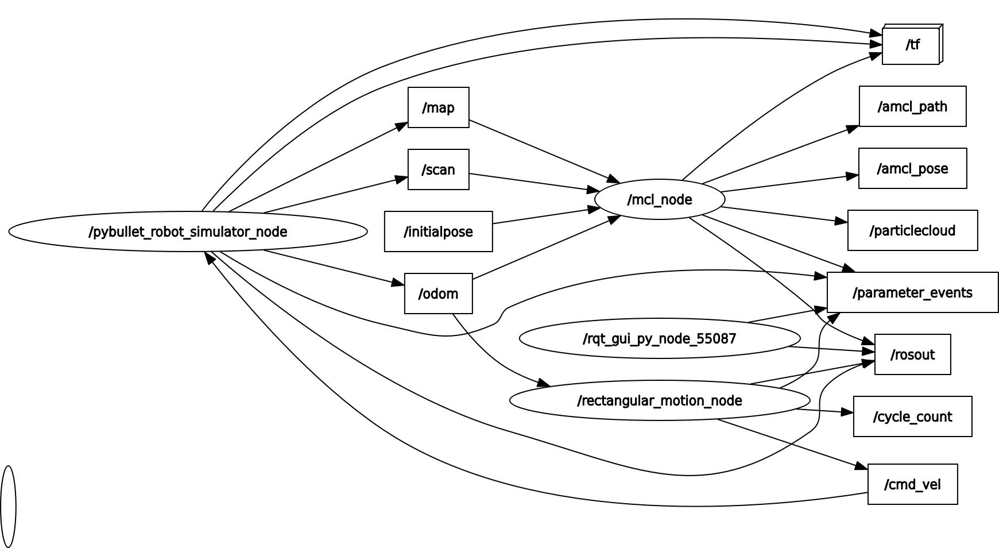
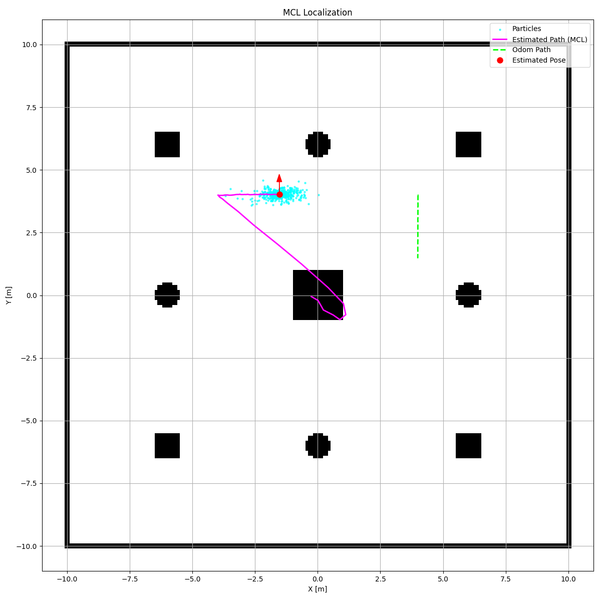
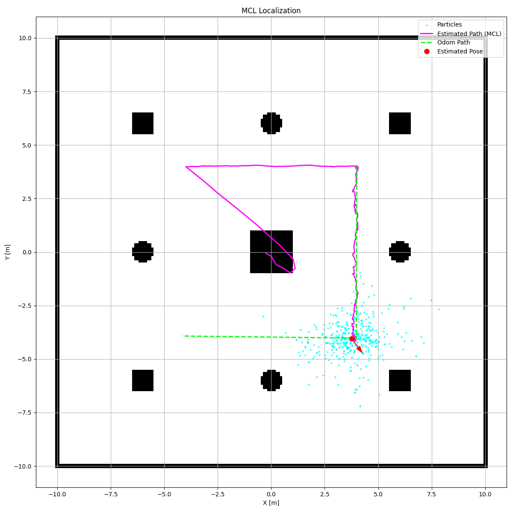
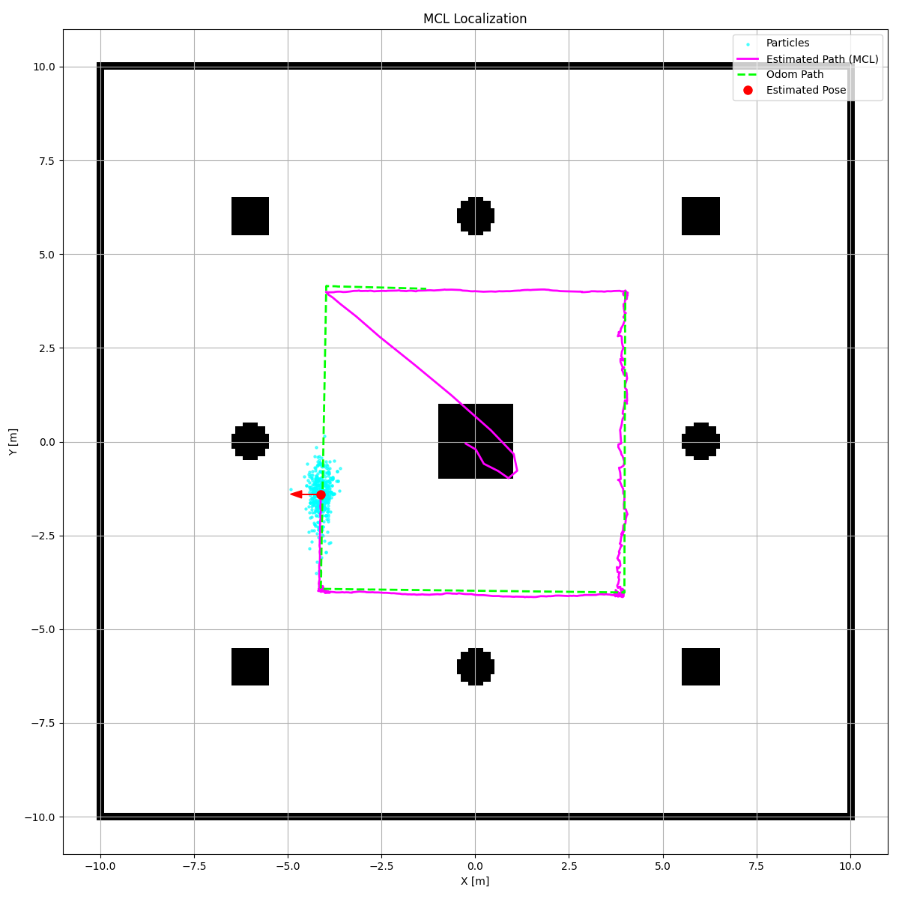
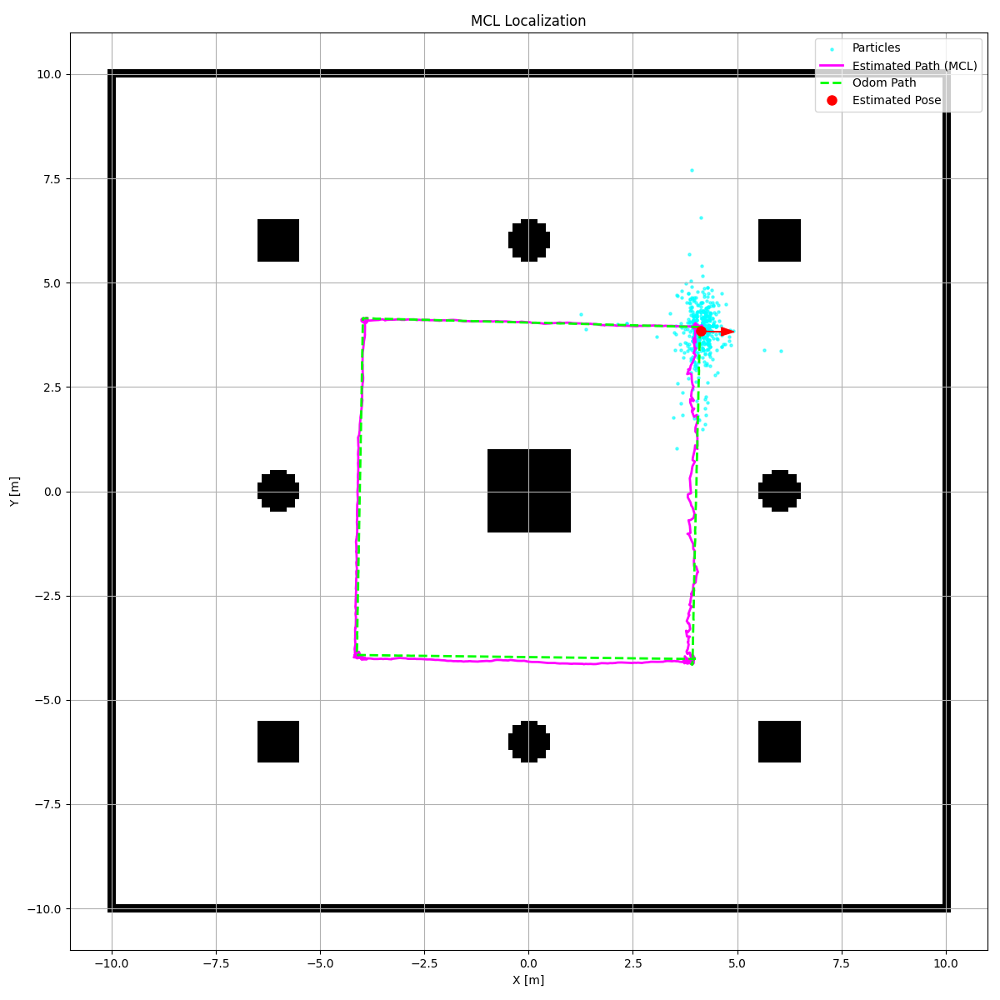

# Monte Carlo Localization (MCL) with PyBullet and RViz2

This ROS 2 package provides a robust implementation of the Monte Carlo Localization (MCL) algorithm, also known as a particle filter. It is designed to estimate the pose (position and orientation) of a robot within a known map by processing odometry and laser scan data from a **PyBullet simulation**.

The package is highly optimized, using vectorized NumPy operations for performance, and is fully integrated with **RViz2** for real-time visualization of the particle cloud and the robot's estimated pose.

---

## 🤖 System Architecture

The `mcl_node` is the central component of this system. It subscribes to the `/odom` and `/scan` topics from the simulator and uses this information to maintain a distribution of weighted particles. It then publishes the localization results to various topics for visualization and use by other nodes, such as a planner.

The ROS computation graph below shows how the `mcl_node` interacts with the simulation and visualization tools:



---

## Monte Carlo Localization Node (`mcl_node`)

This single node contains the complete logic for the MCL algorithm.

### Core Functionality

* **Initialization**: The node waits for a map to be published. Once received, it initializes a set of particles, distributing them randomly across the free space of the map. It can also re-initialize the particles in a tight cluster around a pose provided on the `/initialpose` topic.
* **Prediction (Motion Model)**: When an `/odom` message is received, the node predicts the new position of every particle based on the robot's motion. It applies a probabilistic motion model, adding noise to the movement to account for odometry uncertainty.
* **Update (Sensor Model)**: Upon receiving a `/scan` message, the node updates the weight of each particle. The weight represents the likelihood of that particle being the true location of the robot. This is done by comparing the actual laser scan with the expected scan that would be seen from each particle's pose, calculated via vectorized ray-casting.
* **Resampling**: To combat particle deprivation, a low-variance resampling step is performed. Particles with higher weights are more likely to be duplicated, while those with lower weights are eliminated, focusing the particle cloud on more probable areas.
* **Pose Estimation & TF Publishing**: The final estimated pose of the robot is calculated as the weighted average of all particles. The node publishes this pose, the entire particle cloud, the estimated path, and the crucial `map` -> `odom` transform.

### **Inputs (Subscribed Topics)**

| Topic         | Message Type                        | Description                                                                                             |
| :------------ | :---------------------------------- | :------------------------------------------------------------------------------------------------------ |
| `/map`        | `nav_msgs/msg/OccupancyGrid`        | The static map of the environment, required for initialization and sensor model calculations.           |
| `/odom`       | `nav_msgs/msg/Odometry`             | Provides motion data used for the prediction step.                                                      |
| `/scan`       | `sensor_msgs/msg/LaserScan`         | Provides sensor readings used to update particle weights in the sensor model.                           |
| `/initialpose`| `geometry_msgs/msg/PoseWithCovarianceStamped` | An optional topic (used by RViz2's "2D Pose Estimate" tool) to manually re-initialize the particle filter. |

### **Outputs**

| Type  | Name             | Description                                                                                                                              |
| :---- | :--------------- | :--------------------------------------------------------------------------------------------------------------------------------------- |
| **Topic** | `/amcl_pose`     | Publishes the robot's single best-estimated pose (`geometry_msgs/msg/PoseStamped`).                                                      |
| **Topic** | `/particlecloud` | Publishes the entire set of particles (`geometry_msgs/msg/PoseArray`) for visualization in RViz2.                                        |
| **Topic** | `/amcl_path`     | Publishes the history of estimated poses (`nav_msgs/msg/Path`).                                                                          |
| **Topic** | `/tf`            | Broadcasts the `map` to `odom` transform, which corrects for odometry drift and aligns the robot's local frame with the global map.      |
| **File** | `mcl_plot_*.png`  | A sequence of images saved periodically, showing the evolution of the particle cloud and the estimated path over time.                   |

#### Example Output (Sequence of `mcl_plot_*.png` files)

The images show the particle cloud (cyan dots) converging from a dispersed state to a tight cluster around the robot's true position as it moves.

| Initial State                                     | After Some Movement                               | Converged State                                   | "Kidnapped Robot" Recovery                        |
| :------------------------------------------------: | :------------------------------------------------: | :------------------------------------------------: | :------------------------------------------------: |
|  |  |  |  |

---

## 🚀 How to Build, Run, and Visualize

Follow these steps to launch the MCL localization system.

### Step 1: Run the Simulation

First, ensure you have a simulation environment running that provides the necessary topics. A robot controller is also needed to move the robot.

```bash
# In Terminal 1: Launch the simulation
ros2 run pybullet_sim_pkg robot_simulator_node

# In Terminal 2: Launch a controller to move the robot
ros2 run pybullet_sim_pkg rectangular_motion_node
```
### Step 2: Build and Run the MCL Node
In a new terminal, build the mcl_pkg and run the localization node.
```
# In Terminal 3

# Navigate to your ROS 2 workspace and build the package
colcon build --packages-select mcl_pkg

# Source the workspace
source install/setup.bash

# Run the MCL node
ros2 run mcl_pkg mcl_node
```
### Step 3: Visualize in RViz2
Open RViz2 to see the MCL filter working in real-time.

```
# In Terminal 4
rviz2
```
