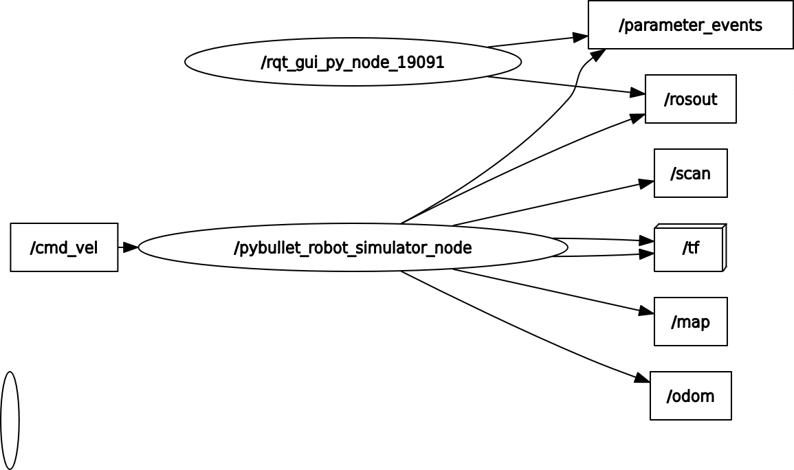

# ROS 2 PyBullet Robot Simulation (`pybullet_sim_pkg`)

This ROS 2 package provides a simple robot simulation environment using the PyBullet physics engine. It is designed to simulate a differential drive robot in a custom world and publish standard ROS 2 messages for sensor data and odometry.

The project includes two main nodes:
1.  **`robot_simulator_node`**: The core simulation environment.
2.  **`rectangular_motion_node`**: An example controller to move the robot in a pattern.

## System Architecture

Here is a simplified diagram of how the nodes and key topics interact:



***

## 1. Robot Simulator Node (`robot_simulator_node`)

This node is the heart of the simulation. It launches a PyBullet physics server, loads a robot and a world, and bridges the simulation with the ROS 2 ecosystem.

### Core Functionality

* **Initialization**: Sets up the PyBullet physics client in GUI mode, loads an R2-D2 URDF model, a ground plane, and a custom environment with walls and obstacles.
* **Simulation Loop**: Runs at a fixed frequency (50 Hz). In each step, it:
    1.  Applies motor forces to the robot's wheels based on velocity commands.
    2.  Steps the physics simulation forward.
    3.  Publishes the robot's pose and sensor data.
* **Map Generation**: On startup, it generates a 2D `OccupancyGrid` of the environment and publishes it once on a "latched" topic, so it remains available for any late-joining nodes (like RViz).

### **Inputs (Subscribed Topics)**

| Topic | Message Type | Description |
| :--- | :--- | :--- |
| `/cmd_vel` | `geometry_msgs/msg/Twist` | Receives linear (x) and angular (z) velocity commands to control the robot's movement. |

### **Outputs (Published Topics)**

| Topic | Message Type | Description |
| :--- | :--- | :--- |
| `/odom` | `nav_msgs/msg/Odometry` | Publishes the robot's estimated position, orientation, and velocity in the `odom` frame. |
| `/scan` | `sensor_msgs/msg/LaserScan` | Publishes simulated 2D LiDAR data by performing raycasting within the PyBullet environment. |
| `/map` | `nav_msgs/msg/OccupancyGrid` | Publishes a static 2D map of the world. This is published once with a transient local (latched) QoS. |
| `/tf` | `tf2_msgs/msg/TFMessage` | Broadcasts the dynamic transform from the `odom` frame to the `base_link` frame. |
| `/tf_static`| `tf2_msgs/msg/TFMessage` | Broadcasts the static transform from the `base_link` frame to the `laser_frame`. |

***

## 2. Rectangular Motion Node (`rectangular_motion_node`)

This node acts as a simple, open-loop controller. Its purpose is to command the robot to move in a rectangular path for a predefined number of cycles.

### Core Functionality

* **State Machine**: The node operates using a simple state machine with two states:
    1.  `moving_forward`: The robot moves straight for a target distance (8.0 meters).
    2.  `turning`: The robot rotates in place for a target angle (90 degrees, or π/2 radians).
* **Odometry Feedback**: It uses `/odom` messages from the simulator to track how far it has moved and how much it has turned, allowing it to decide when to switch states.
* **Cycle Count**: It counts how many full rectangles it has completed and publishes this count. It automatically shuts down after completing a target number of cycles (e.g., 5).

### **Inputs (Subscribed Topics)**

| Topic | Message Type | Description |
| :--- | :--- | :--- |
| `/odom` | `nav_msgs/msg/Odometry` | Used to get the current position and orientation of the robot to calculate distance traveled and angle turned. |

### **Outputs (Published Topics)**

| Topic | Message Type | Description |
| :--- | :--- | :--- |
| `/cmd_vel` | `geometry_msgs/msg/Twist` | Publishes velocity commands to make the robot move forward or turn according to the current state. |
| `/cycle_count` | `std_msgs/msg/Int32` | Publishes the number of rectangular cycles completed. |

***

## How to Build and Run

### 1. Build the Package
Navigate to the root of your ROS 2 workspace and build the package:
```bash
colcon build --packages-select pybullet_sim_pkg
```

## 2. Source the Workspace

Source the setup file to make the executables available in your terminal:
```
source install/setup.bash
```


## 3. Run the Nodes

You need two separate terminals to run the simulation and the controller:

**In Terminal 1**, start the simulation:
```
ros2 run pybullet_sim_pkg robot_simulator_node
```
This will open a PyBullet window showing the robot in its environment.

**In Terminal 2**, start the motion controller:

```
ros2 run pybullet_sim_pkg rectangular_motion_node
```
